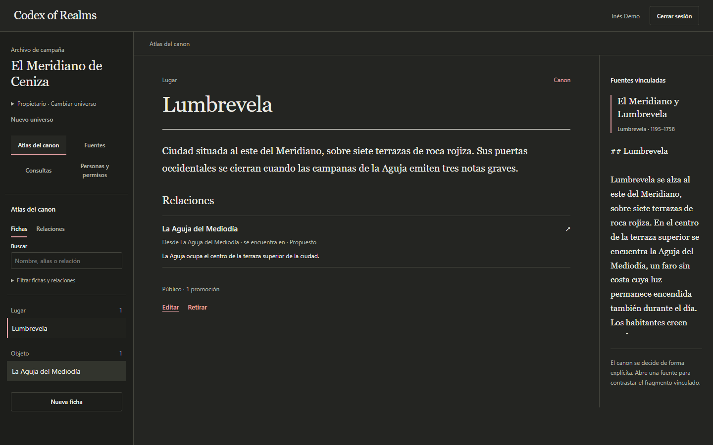

# Codex of Realms

[](https://github.com/sogekingdabest/codex-of-realms/actions/workflows/ci.yml)
[](https://github.com/sogekingdabest/codex-of-realms/releases)
[](LICENSE)

[English](README.md) · **Español** · [Galego](README.gl.md)

Un archivo compartido para campañas de rol de mesa. Reúne notas de sesión, personajes y lugares, y deja que cada jugador vea solo lo que su personaje puede saber.

Por ejemplo, quien dirige la partida puede guardar en privado la verdad sobre una torre antigua, compartir su historia pública con todo el grupo y revelar una pista a un solo jugador. Cada persona puede recorrer sus fuentes o hacer una pregunta y abrir los pasajes en los que se basa la respuesta.

La interfaz está en castellano. Todo se ejecuta en tu equipo, incluidos los modelos de lenguaje. La primera beta es la [0.1.0-beta](CHANGELOG.md#010-beta--2-october-2026). La documentación detallada está en inglés.

## Qué puedes hacer

- Subir y leer archivos Markdown o de texto, buscar por título o nombre de archivo y sustituir un documento mientras su versión anterior sigue disponible.
- Organizar personajes, lugares, facciones, objetos y sucesos en el **Atlas del canon**, con relaciones y referencias a las fuentes.
- Invitar a editores y jugadores, mantener en privado las notas de la dirección y revelar spoilers a quien elijas.
- Hacer preguntas sobre las fuentes publicadas y consultar el texto original de cada cita.

El atlas se mantiene a mano. Las preguntas usan los documentos subidos; editar una ficha del atlas no cambia esos documentos.

## Míralo en marcha



[Ver el recorrido breve](demo/assets/recorrido.webm) · [Recorrido guiado y capturas](demo/RECORRIDO.md)

Capturado el 20 de septiembre con una versión anterior de la interfaz, datos de una campaña ficticia y modelos locales. El recorrido se grabó con los modelos ya cargados.

## Ejecútalo en tu equipo

Necesitas:

- Docker con Compose.
- Unos 16 GB de RAM y espacio para las imágenes de los contenedores y unos 5 GB de modelos. Se recomienda una GPU NVIDIA de 6 GB; sin ella, los modelos usan la CPU y las respuestas tardan más.
- PowerShell para cargar la campaña de ejemplo (`pwsh` en Linux y macOS).

1. Copia `.env.example` a `.env` y pon las tres contraseñas.
2. Desde la raíz del repositorio, arranca los servicios y descarga los modelos. Las descargas se hacen una vez por volumen de Ollama.

   ```sh
   docker compose up -d --build --wait
   docker compose exec ollama ollama pull bge-m3
   docker compose exec ollama ollama pull qwen3.5:4b
   ```

   Con una GPU NVIDIA, arráncalos con `docker compose -f compose.yaml -f compose.gpu.yaml up -d --build --wait`.
3. Carga la campaña de ejemplo:

   ```sh
   ./scripts/load-demo-campaign.ps1
   ```

   Crea El Meridiano de Ceniza con tres cuentas y muestra su contraseña: Inés dirige la partida, Tala conoce un spoiler y Oren solo ve el canon público.
4. Abre [la aplicación](http://localhost:5173) y entra. Usa una ventana privada para cada cuenta y compara lo que ve cada una.

Si prefieres empezar tu propia campaña, regístrate en la aplicación y confirma tu correo en [Mailpit](http://localhost:8025), el buzón local. Después crea un universo y sube tus notas. Si abriste la aplicación antes de que terminaran las descargas, recárgala.

La [guía de la demo](docs/operations/DEMO.md) incluye un recorrido de ocho minutos. [Desarrollo local](docs/operations/LOCAL_DEVELOPMENT.md) explica los puertos y cómo resolver problemas, y las instalaciones existentes deben seguir los [pasos de actualización](OPERATIONS.md#upgrade-an-existing-installation). Para parar los servicios, usa `docker compose down`; tus datos se quedan en los volúmenes de Docker.

## Cómo funciona

React y TypeScript forman el cliente. Una aplicación Spring Boot con Java 21 gestiona los permisos, la ingesta de documentos y las preguntas. PostgreSQL guarda los datos de la campaña y los embeddings de pgvector; Keycloak gestiona el acceso y Ollama ejecuta los modelos.

El backend filtra las fuentes por permisos antes de ordenar los resultados de búsqueda. El modelo elige los pasajes y el servidor copia el texto original en la respuesta. El procesamiento de documentos usa trabajos persistentes, así que lo que falla se puede reintentar.

La [arquitectura](docs/architecture/ARCHITECTURE.md) explica el porqué de estas decisiones.

## Comprobaciones

Con Java 21 y Docker disponibles, ejecuta desde `backend/`:

```sh
./mvnw --batch-mode --no-transfer-progress verify
```

En Windows, usa `.\mvnw.cmd`. Con Node.js 24, ejecuta desde `frontend/`:

```sh
npm ci
npm run verify
```

Estas órdenes ejecutan las pruebas del backend y, en el frontend, lint, pruebas, cobertura y compilación. Las pruebas de navegador, la recuperación de copias y la evaluación de modelos tienen [instrucciones aparte](OPERATIONS.md#reproducible-acceptance).

## Limitaciones

La instalación incluida es solo para uso local. Se pueden subir archivos Markdown y de texto de hasta 1 MiB. Un pasaje citado puede ser exacto y aun así incompleto, por eso el lector de fuentes sigue disponible para comprobar las respuestas. La primera respuesta tras arrancar puede tardar alrededor de un minuto mientras se cargan los modelos. La lista completa está en [limitaciones actuales](docs/product/LIMITATIONS.md).

[Documentación](docs/README.md) · [Hoja de ruta](ROADMAP.md) · [Cambios](CHANGELOG.md) · [Cómo contribuir](CONTRIBUTING.md) · [Seguridad](SECURITY.md)

## Licencia

[MIT](LICENSE). La campaña de demostración es material original del proyecto. Las dependencias conservan sus propias licencias.
