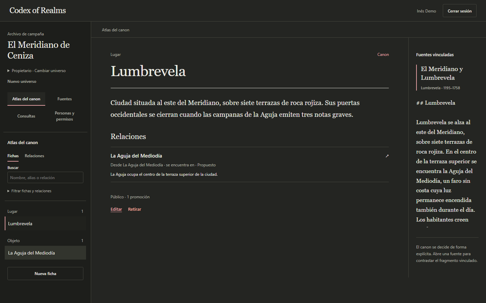

# Codex of Realms

A shared archive for tabletop role-playing campaigns. Keep session notes, characters and places together, and let each player see only what their character is allowed to know.

For example, the Game Master can keep the truth about an ancient tower private, share its public history with everyone, and reveal a clue to one player. Each person can browse their sources or ask a question and open the passages behind the answer.

The interface is in Spanish. The application runs locally and is being prepared for its first beta.

## What you can do

- Upload and read Markdown or text files, search by title or filename, and replace a document while its previous version stays available.
- Organize characters, places, factions, objects and events in the **Atlas del canon**, with relationships and source references.
- Invite editors and players, keep Game Master notes private and reveal spoilers to selected members.
- Ask questions about published sources and inspect the original text behind each citation.

The atlas is curated manually. Questions use uploaded documents; editing an atlas entry does not change those documents.

## See it in action



[Watch the short walkthrough](demo/assets/recorrido.webm) · [Five-minute presentation and screenshots](demo/PORTFOLIO.md)

Captured from the running application with fictional campaign data and local models. The walkthrough is in Spanish; it shows a prepared session, with models loaded before recording.

## Run locally

You need Docker with Compose. Copy `.env.example` to `.env`, set the local passwords, then run from the repository root:

```sh
docker compose up -d --build --wait
docker compose exec ollama ollama pull bge-m3
docker compose exec ollama ollama pull qwen3.5:4b
```

The model downloads are needed once per Ollama volume. If you change the model tags in `.env`, download those tags instead.

Open [the application](http://localhost:5173), register, and follow the verification email in [Mailpit](http://localhost:8025). Finish setting your password, create a universe, then upload a file from [the public demo sources](demo/lore/public/) with **Público** visibility. Reload the application if you prepared the models after opening it.

The [demo guide](docs/operations/DEMO.md) walks through a campaign with a Game Master and two players. For requirements, GPU setup and troubleshooting, see [local development](docs/operations/LOCAL_DEVELOPMENT.md). Existing installations should follow the [upgrade steps](OPERATIONS.md#upgrade-an-existing-installation).

Stop with `docker compose down` to keep your data.

## Built with

React and TypeScript provide the client. A Java 21 Spring Boot application handles permissions, ingestion and questions. PostgreSQL stores campaign data and pgvector embeddings; Keycloak handles login, and Ollama runs the models.

The backend filters sources by permission before ranking search results. The model selects passages, and the server copies the original text into the answer. Document processing uses persistent jobs so failed work can be retried.

Read the [architecture](docs/architecture/ARCHITECTURE.md) for the reasoning behind these choices.

## Checks

With Java 21 and Docker available, run from `backend/`:

```sh
./mvnw --batch-mode --no-transfer-progress verify
```

On Windows, use `.\mvnw.cmd`. With Node.js 24, run from `frontend/`:

```sh
npm ci
npm run verify
```

These commands run the backend tests and frontend lint, tests, coverage checks and build. Browser tests, recovery drills and model evaluation have [separate instructions](OPERATIONS.md#reproducible-acceptance).

## Before you try it

The supplied setup is for local use. Uploads support Markdown/TXT up to 1 MiB by default. AI answers can miss useful context, so the source reader remains available to check them. See [current limitations](docs/product/LIMITATIONS.md) for the remaining beta work.

[Documentation](docs/README.md) · [Roadmap](ROADMAP.md) · [Changelog](CHANGELOG.md) · [Contributing](CONTRIBUTING.md) · [Security](SECURITY.md)

## License

[MIT](LICENSE). The demonstration campaign is original project material. Dependencies retain their own licenses.
