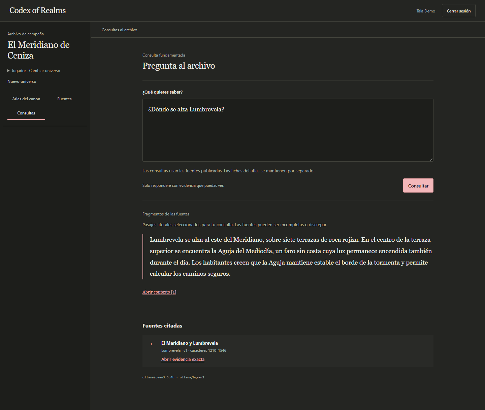

# Codex of Realms en cinco minutos

Una campaña acumula notas, personajes y secretos. Codex of Realms permite recorrer esa información y consultar sus fuentes sin mostrar a cada jugador todo lo que sabe quien dirige la partida.

La demo usa **El Meridiano de Ceniza**, una campaña ficticia original. Inés dirige la partida; Tala conoce el recuerdo de Nara y Oren todavía no. Ninguno de los jugadores puede leer la deuda de la Aguja, reservada a dirección.

## Vídeo y capturas

[Ver el recorrido de 45 segundos, sin audio](assets/recorrido.webm). Muestra la sesión de Tala: Atlas, relación entre fichas, biblioteca, consulta y documento citado. La grabación es continua y los modelos se cargaron antes de empezar. Las pausas permiten leer la pantalla; no representan una medición de rendimiento.

También puedes comparar las [fuentes de dirección](assets/fuentes-direccion.png), las [fuentes de Tala](assets/fuentes-jugadora.png) y las [fuentes de Oren](assets/fuentes-jugador.png), o abrir el [lector de documentos](assets/lector.png).

Material capturado el 20 de septiembre de 2026 con backend, Keycloak, PostgreSQL y Ollama reales. Usa el estado de `0b70ac3`, que incluye la corrección del aviso de modelos. Las cuentas y sus contraseñas quedan fuera del repositorio.

## Recorrido para una entrevista

| Tiempo | Qué mostrar | Qué explicar |
|---|---|---|
| 0:00–0:40 | La ficha de Lumbrevela | «Quiero encontrar un detalle de la campaña sin repasar todas las notas ni revelar un secreto por accidente». |
| 0:40–1:30 | La relación con la Aguja y la fuente vinculada | Las fichas se mantienen a mano. Una referencia permite comprobar de dónde sale una descripción. Promover a canon es una decisión de quien edita. |
| 1:30–2:20 | Las fuentes de Inés y las de Tala | Inés ve los tres documentos; Tala ve el público y su spoiler. Oren solo ve el público. El servidor aplica estos permisos también al recuperar evidencia. |
| 2:20–3:30 | «¿Dónde se alza Lumbrevela?» y «Abrir contexto» | El modelo selecciona pasajes. El servidor copia el texto original y vuelve a comprobar permisos y versión; una cita permite revisar la fuente, pero no garantiza que sea verdadera o suficiente. |
| 3:30–4:20 | El documento completo | La búsqueda por título y la lectura funcionan sin pedir una respuesta a la IA. El Atlas se edita por separado de las fuentes usadas en consultas. |
| 4:20–5:00 | Arquitectura y límites | Java/Spring Boot en un monolito modular, React, PostgreSQL/pgvector, Keycloak y Ollama. La instalación es local; faltan pruebas de utilidad con grupos externos. |

No hace falta enseñar el registro ni descargar modelos durante la presentación. La [guía de preparación](../docs/operations/DEMO.md) cubre esos pasos. Haz una consulta poco antes de empezar: en el [ensayo](../reviews/2026-09-20-ensayo-instalacion.md), la carga inicial fue mucho más lenta que la repetición inmediata.

## Preguntas técnicas que permite explicar

- **¿Por qué un monolito modular?** Comparte despliegue y transacciones; los límites entre módulos se comprueban con pruebas. [Decisiones](../docs/architecture/DECISIONS.md).
- **¿Dónde se aplican los permisos?** Antes de recuperar fuentes y de nuevo antes de devolver sus citas. [Autorización](../docs/security/AUTHORIZATION_MODEL.md).
- **¿Qué ocurre si falla una sustitución?** La versión anterior sigue publicada y el trabajo se puede reintentar. [Operación](../OPERATIONS.md).
- **¿Qué se ha medido?** Los informes separan pruebas deterministas, navegador y modelos reales. [Ensayo de instalación](../reviews/2026-09-20-ensayo-instalacion.md) y [evaluaciones](evaluation/README.md).

## Texto breve para el currículum

> Aplicación local para organizar campañas de rol con permisos por usuario, documentos versionados y consultas con citas. Backend Java/Spring Boot, frontend React/TypeScript, PostgreSQL/pgvector, Keycloak y modelos locales con Ollama. Incluye pruebas de autorización, recuperación de trabajos y recorridos de navegador en CI.

Úsalo como descripción del proyecto y adáptalo al puesto. La demo no acredita uso por clientes ni validación con jugadores externos. El estado y las restricciones están en [limitaciones](../docs/product/LIMITATIONS.md).
