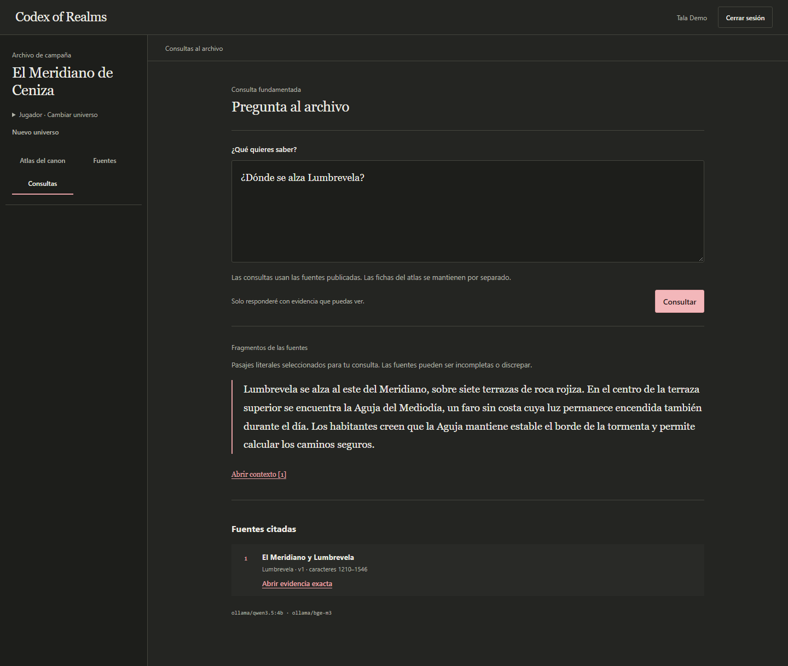

# Recorrido por la demo

Una campaña acumula notas, personajes y secretos. Codex of Realms permite recorrer esa información y consultar sus fuentes sin mostrar a cada jugador todo lo que sabe quien dirige la partida.

La demo usa **El Meridiano de Ceniza**, una campaña ficticia original. Inés dirige la partida; Tala conoce el recuerdo de Nara y Oren todavía no. Ninguno de los jugadores puede leer la deuda de la Aguja, reservada a dirección.

## Vídeo y capturas

[Ver el recorrido de 45 segundos, sin audio](assets/recorrido.webm). Muestra la sesión de Tala: Atlas, relación entre fichas, biblioteca, consulta y documento citado. La grabación es continua y los modelos se cargaron antes de empezar. Las pausas permiten leer la pantalla; no representan una medición de rendimiento.

También puedes comparar las [fuentes de dirección](assets/fuentes-direccion.png), las [fuentes de Tala](assets/fuentes-jugadora.png) y las [fuentes de Oren](assets/fuentes-jugador.png), o abrir el [lector de documentos](assets/lector.png).

Material capturado el 20 de septiembre de 2026 con backend, Keycloak, PostgreSQL y Ollama reales. Usa el estado de `0b70ac3`, que incluye la corrección del aviso de modelos. Las cuentas y sus contraseñas quedan fuera del repositorio.

## Qué muestra

| Pantalla | Qué ocurre |
|---|---|
| La ficha de Lumbrevela | Las fichas del Atlas se mantienen a mano y enlazan la fuente de la que sale cada descripción. |
| La relación con la Aguja | Una referencia permite comprobar de dónde sale una relación. Promover una propuesta a canon es una decisión de quien edita. |
| Las fuentes de Inés, Tala y Oren | Inés ve los tres documentos; Tala ve el público y su spoiler; Oren solo ve el público. El servidor aplica estos permisos también al recuperar evidencia. |
| «¿Dónde se alza Lumbrevela?» y «Abrir contexto» | El modelo selecciona pasajes. El servidor copia el texto original y vuelve a comprobar permisos y versión; una cita permite revisar la fuente, pero no garantiza que sea verdadera o suficiente. |
| El documento completo | La búsqueda por título y la lectura funcionan sin pedir una respuesta a la IA. El Atlas se edita por separado de las fuentes usadas en las consultas. |

Para reproducirlo en tu equipo, sigue la [guía de la demo](../docs/operations/DEMO.md). La primera consulta tras arrancar tarda más mientras se cargan los modelos; en el [ensayo](../reviews/2026-09-20-ensayo-instalacion.md), la carga inicial fue mucho más lenta que la repetición inmediata.

## Preguntas técnicas

- **¿Por qué un monolito modular?** Comparte despliegue y transacciones; los límites entre módulos se comprueban con pruebas. [Decisiones](../docs/architecture/DECISIONS.md).
- **¿Dónde se aplican los permisos?** Antes de recuperar fuentes y de nuevo antes de devolver sus citas. [Autorización](../docs/security/AUTHORIZATION_MODEL.md).
- **¿Qué ocurre si falla una sustitución?** La versión anterior sigue publicada y el trabajo se puede reintentar. [Operación](../OPERATIONS.md).
- **¿Qué se ha medido?** Los informes separan pruebas deterministas, navegador y modelos reales. [Ensayo de instalación](../reviews/2026-09-20-ensayo-instalacion.md) y [evaluaciones](evaluation/README.md).

La demo usa datos ficticios y no acredita uso con jugadores reales. Las restricciones actuales están en [limitaciones](../docs/product/LIMITATIONS.md).
