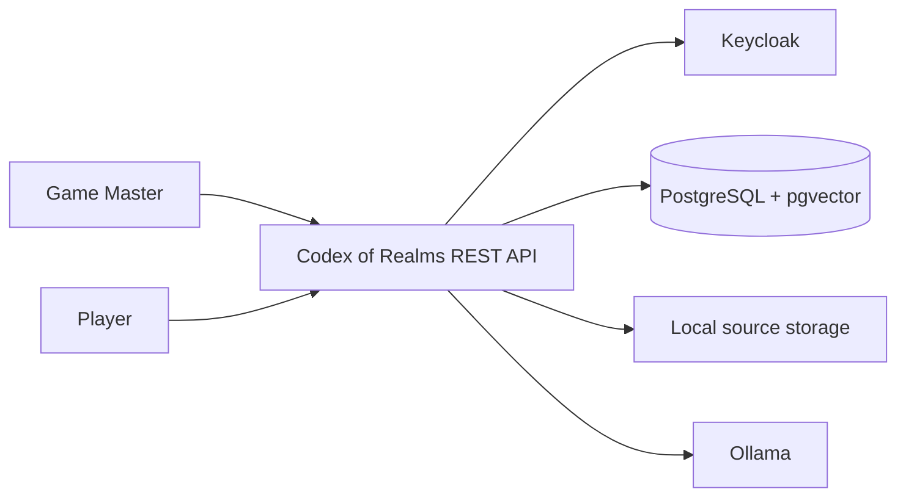
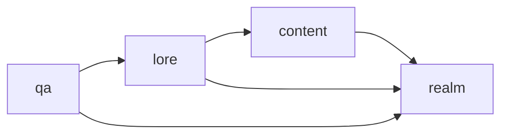
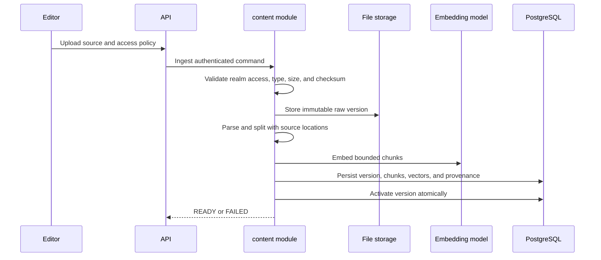
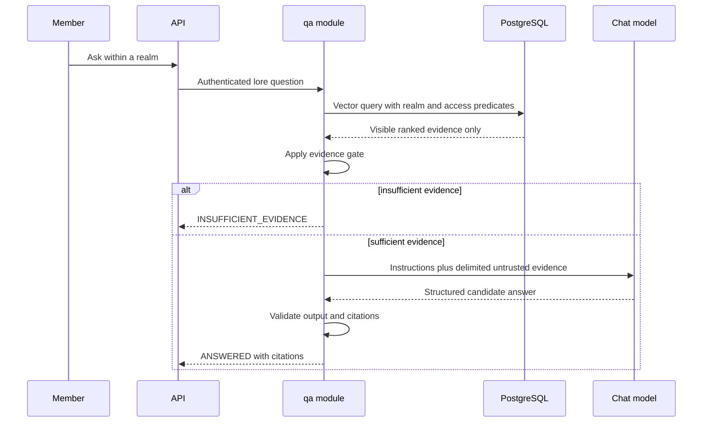

# Initial Architecture

- **Status:** M5 grounded answers implemented
- **Next domain milestone:** M6 lore catalogue

## Architectural drivers

- Strong realm and spoiler isolation
- Traceable RAG answers and explicit abstention
- Local execution on constrained development hardware
- Small independently testable business modules
- Reproducible CI without a live generative model
- Replaceable identity and model providers at external boundaries
- No distributed-system complexity without a measured requirement

## System context

Keycloak authenticates users. Codex of Realms owns realm membership and authorization. PostgreSQL stores transactional records and embeddings. Raw source files live in a local volume behind an application-owned storage port. Ollama provides local embedding and chat models.

## Deployment view

The MVP contains four Docker Compose services:

1. `app`: one Java 21 Spring Boot process.
2. `postgres`: one PostgreSQL instance with pgvector.
3. `keycloak`: the development OpenID Connect provider.
4. `ollama`: the default local model runtime.

Model download may require an explicit documented preparation command because pulling a large model implicitly during every startup is slow and surprising. Observability services are added under an optional profile only after meaningful metrics exist.

M1 fixes the container baseline at PostgreSQL 18 with pgvector 0.8.6, Keycloak 26.7.2, and Ollama 0.32.5. M3 enables explicitly preloaded `bge-m3` embeddings. M5 enables explicitly preloaded `qwen3:4b` chat generation with deterministic gate and validation controls outside the model.

## Application modules

### `realm`

Realm lifecycle, memberships, roles, spoiler grants, and effective-access decisions. Authorization is a realm domain capability, not a generic collection of Spring Security helpers.

### `content`

Source documents, immutable versions, storage, ingestion, chunks, and embedding provenance.

### `lore`

Manual entities, typed relations, canon status, and structured provenance.

### `qa`

Question answering through the public `LoreSearch` facade, deterministic evidence gating, model orchestration, structured outcomes, and citation validation. The model adapter is replaceable; authorization and validation are not provider responsibilities.

### `shared`

Only stable cross-cutting primitives such as identifiers, time abstraction, and common error contracts. Domain concepts remain in their owning modules.

## Internal module structure

Each capability is organized feature-first. Its public module package contains only the facade, public commands/queries, events, and value contracts required by other modules. Implementation packages separate:

- `domain`: behavior and invariants without infrastructure dependencies
- `application`: use-case orchestration and ports
- `infrastructure`: persistence, storage, identity, and model adapters
- `web`: REST controllers and transport mapping

The exact package arrangement will be verified with Spring Modulith in M1 before significant implementation accumulates.

## Source ingestion flow

Synchronous execution is acceptable for bounded Markdown/TXT files. The document lifecycle and idempotency rules allow a later asynchronous implementation without changing the external meaning.

## Question-answering flow

## Persistence strategy

- PostgreSQL is the system of record.
- Realm scope is a required column and predicate on protected tables.
- Document metadata and ACL grants remain relational.
- Vectors are stored alongside source-derived chunk identity and provenance.
- Access-aware similarity search is implemented behind `LoreRetriever` and may use native SQL where the generic vector-store API cannot express the required relational policy safely.
- Exact nearest-neighbour search is the baseline. HNSW is introduced only after corpus size and measured latency justify its recall trade-off.
- Flyway owns all schema evolution.

## Model integration

Application code depends on its own use-case ports backed by Spring AI model abstractions. Provider-specific names, options, token counts, and errors are translated at the adapter boundary.

Chat and embedding models have separate configuration and provenance. Changing the embedding model, dimension, or material preprocessing configuration creates a new index generation and requires controlled reprocessing.

## Testing strategy

- Pure unit tests for domain invariants and evidence-gate rules
- Spring Modulith verification and module integration tests
- PostgreSQL/pgvector integration tests with Testcontainers
- Authorization matrix and cross-realm negative tests
- API contract tests for error and citation shapes
- Deterministic embedding/chat doubles for normal CI
- Separately executed real-model evaluation using the versioned demo dataset
- A small end-to-end Keycloak suite, with faster signed-JWT fixtures elsewhere

## Observability

Initial telemetry includes:

- Ingestion duration, status, chunk count, and failure category
- Retrieval latency, authorized result count, and safe score summaries
- Evidence-gate outcomes and refusal count
- Model duration, model identifier, and token counts where available
- API latency and error rate

Telemetry excludes bearer tokens and raw lore content by default. Prometheus and Grafana are optional consumers of useful Micrometer metrics, not milestone decoration.

## Evolution triggers

Architecture changes require evidence:

- Introduce background processing when synchronous ingestion exceeds agreed request limits or harms availability.
- Introduce a broker when work must survive process failure or multiple workers need coordination.
- Introduce approximate vector indexes when exact search misses measured latency targets at representative scale.
- Introduce a graph database when graph traversal requirements cannot be expressed acceptably in PostgreSQL.
- Introduce a Python service when an evaluated ML workload needs libraries or runtime characteristics unsuitable for the Java process.
- Introduce browser inference only after a web client exists and its security, compatibility, and quality trade-offs are measured.

## Related decisions

- [ADR-001: Start as a package-modular monolith](adr/ADR-001-modular-monolith.md)
- [ADR-002: Use Keycloak as the local OpenID Connect provider](adr/ADR-002-local-identity-provider.md)
- [ADR-003: Use server-side local models for the MVP](adr/ADR-003-local-model-runtime.md)
- [ADR-004: Fix the M1 technology baseline](adr/ADR-004-m1-technology-baseline.md)
- [ADR-005: Store immutable source versions and explicit embedding provenance](adr/ADR-005-source-ingestion.md)
- [ADR-006: Filter authorized candidates before exact vector ranking](adr/ADR-006-access-aware-retrieval.md)
- [ADR-007: Gate and validate every generated answer outside the model](adr/ADR-007-deterministic-grounded-answers.md)
