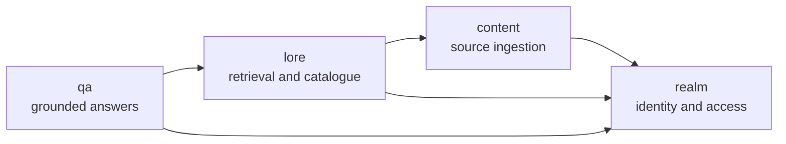

# Application modules

Spring Modulith verifies the package boundaries on every Maven build and generates a PlantUML component diagram plus one canvas per module in `backend/target/spring-modulith-docs/`.

| Module | Owns | Public collaboration boundary |
|---|---|---|
| `realm` | identities, realms, memberships, roles, policies, grants | realm access and authenticated identity contracts |
| `content` | source documents, immutable versions, storage, chunks, embeddings | ingestion and source-management contracts |
| `lore` | access-aware retrieval, entities, relations, canon and provenance | `LoreSearch`, retrieval and catalogue views |
| `qa` | evidence gate, model adapter, answer validation and citations | question-answering contracts |

The dependencies point inward toward the authorization boundary. No model adapter or web controller decides access. Generated files remain build artifacts so they cannot become stale committed snapshots; this document records the stable architectural intent.
