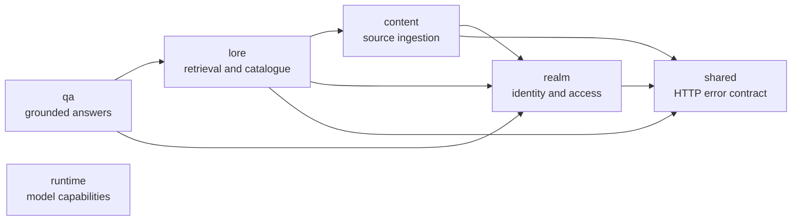
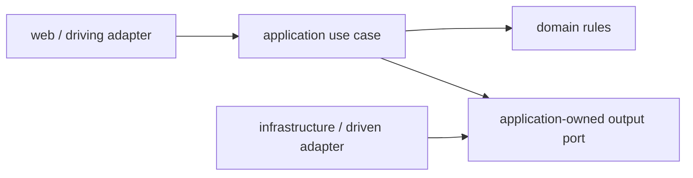

# Application modules

Each module groups one area of the application and exposes a small API to its neighbors. Maven verification checks the boundaries with Spring Modulith and generates diagrams in `backend/target/spring-modulith-docs/`.

| Module | Owns | Public collaboration boundary |
|---|---|---|
| `realm` | identities, realms, memberships, roles, policies, grants | realm access and authenticated identity contracts |
| `content` | source documents, immutable versions, storage, chunks, embeddings | `SourceEvidenceAccess` and stable evidence/embedding contracts |
| `lore` | access-aware retrieval, entities, relations, canon and provenance | `LoreSearch`, retrieval and catalogue views |
| `qa` | evidence gate, model adapter, answer validation and citations | question-answering contracts |
| `runtime` | model-runtime discovery and readiness reporting | `/api/v1/capabilities` through an application-owned runtime probe |
| `shared` | canonical construction of RFC Problem Details responses | `ApiProblemDetails` HTTP transport contract |

Use-case services and database queries enforce access. Controllers translate HTTP requests, and model adapters handle inference. Generated diagrams stay with build output; this page explains the relationships.

## Internal dependency direction

Use cases declare the interfaces they need. Infrastructure implements them for JDBC, Ollama and file storage. This lets application tests substitute an adapter without changing business rules.

Spring Modulith verifies the six modules and the allowed inter-module dependencies declared in each `package-info.java`. `shared` has no internal module dependencies; `realm`, `content` and `lore` use its canonical HTTP error factory. `InternalArchitectureTest` additionally enforces that `application` does not depend on `infrastructure` or `adapter`, that domain code remains independent from outer layers, that public module APIs do not expose adapter details, and that every production exception handler uses that factory.

Application packages group related use cases so they can change and be tested together.
`realm.application` contains `identity`, `lifecycle`, `membership`, `invitation` and `access`.
Realm persistence exposes `RealmLifecycleRepository`, `MembershipRepository`, `InvitationRepository` and
`AccessPolicyRepository`; the single JDBC adapter implements all four without becoming an application dependency.
`content.application` contains `ingestion`, `source` and `evidence`; they share the application-owned
`SourceRepository` while raw storage remains an output port. The catalogue likewise separates entity and relation
use cases while sharing its persistence port and stable domain contracts.

`SourceController` preserves the existing HTTP contract and composes `SourceIngestionService` with
`SourceManagementService`. Metadata coordinators delimit short JDBC transactions, so file operations and embedding
calls do not hold database transactions open. `SourceEvidenceAccess` remains the public facade consumed by `lore`
and delegates to `SourceEvidenceService` and `VisiblePassageService` for catalogue evidence and literal passage access.

Realm lifecycle, membership, invitation and access-policy controllers preserve the existing `/api/v1/realms`
contract while depending only on their corresponding application service. Authenticated controllers receive the
public `AuthenticatedUser` contract through `@CurrentUser`; the application-level MVC resolver is the only component
that translates JWT claims and synchronizes external identities through `RealmAccess`. Each public use case owns its
transaction, while `RealmAuthorizationService` centralizes owner/editor/member checks and the check-lock-recheck
sequences used by sensitive writes. Frontend hooks use similarly focused TypeScript interfaces, backed by one `HttpRealmApi` through `api.realm`. Web adapters translate application failures into HTTP responses.
Each owning module decides the exception mapping, HTTP status, title, detail and code; `shared.ApiProblemDetails`
constructs the common RFC Problem Details representation with a stable `code` property and matching
`urn:codex-of-realms:problem:*` type.
