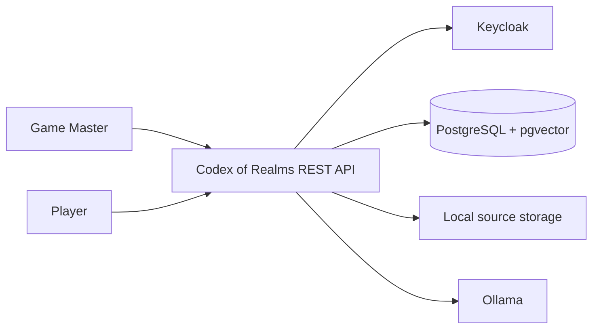
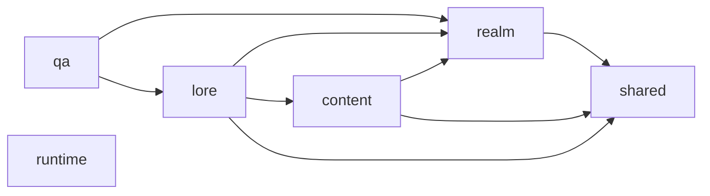
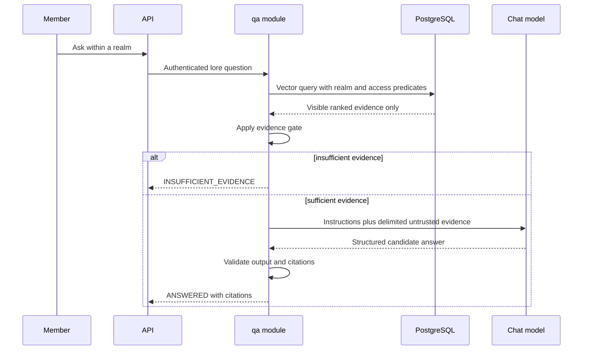

# Initial Architecture

> Historical record. See [current documentation](../../README.md) for setup and behavior.

- **Status:** M9 canon workspace complete; M5.1 comparative model review accepted
- **Next milestone:** Preserve the reviewed quality and authorization gates while extending the product

## Architectural drivers

- Strong realm and spoiler isolation
- Traceable RAG answers and explicit abstention
- Local execution on constrained development hardware
- Small independently testable business modules
- Reproducible CI without a live generative model
- Replaceable identity and model providers at external boundaries
- No distributed-system complexity without a measured requirement

## System context



Keycloak authenticates users. Codex of Realms owns realm membership and authorization. PostgreSQL stores transactional records and embeddings. Raw source files live in a local volume behind an application-owned storage port. Ollama provides local embedding and chat models.

## Deployment view

The local product contains five Docker Compose services:

1. `app`: one Java 21 Spring Boot process.
2. `postgres`: one PostgreSQL instance with pgvector.
3. `keycloak`: the development OpenID Connect provider.
4. `ollama`: the default local model runtime.
5. `web`: the unprivileged Nginx container serving the React client and proxying `/api`.

Models are downloaded through a separate preparation command to avoid delaying startup. The optional M7 overlay provides Prometheus and Grafana for retrieval and QA metrics.

M1 fixes the container baseline at PostgreSQL 18 with pgvector 0.8.6 and Keycloak 26.7.2. The current local runtime is Ollama 0.33.2. M3 enables explicitly preloaded `bge-m3` embeddings. M5 introduced `qwen3:4b` chat generation with deterministic gate and validation controls outside the model. M5.1 made the tag runtime-selectable, added an explicit NVIDIA GPU override, and promoted `qwen3.5:4b` after the reviewed native and Docker comparison.

## Application modules



### `realm`

Realm lifecycle, memberships, roles, spoiler grants, and effective-access decisions. Authorization is a realm domain capability, not a generic collection of Spring Security helpers.

Its application layer is organized in vertical slices:

| Slice | Responsibility |
|---|---|
| `identity` | synchronize the external identity and expose the current user |
| `lifecycle` | create, list and obtain realms |
| `membership` | manage active memberships and protect the last owner |
| `invitation` | normalize, create, accept and revoke invitations |
| `access` | authorize realm operations and manage policies and spoiler grants |

The slices own four narrow output ports: `RealmLifecycleRepository`, `MembershipRepository`,
`InvitationRepository` and `AccessPolicyRepository`. A single JDBC adapter implements them without exposing SQL or
persistence types to application code. Public use cases own their transaction boundaries; blocking authorization
joins those transactions and preserves the check-lock-recheck order. `InvitationStatus` belongs to the domain
because it is persisted business state.

### `content`

Source documents, immutable versions, storage, ingestion, chunks, and embedding provenance.

| Slice | Responsibility |
|---|---|
| `ingestion` | validate, version, store, chunk, embed and activate source uploads |
| `source` | list, inspect, read and retire active sources |
| `evidence` | authorize, validate and resolve stable source evidence for other modules |

The slices share one `SourceRepository` and one JDBC adapter. `SourceIngestionService` keeps filesystem and model
operations outside JDBC transactions; `IngestionMetadataCoordinator` opens short transactions for version and
status changes. `SourceManagementService` follows the same rule for raw reads and deletion, while the public
`SourceEvidenceAccess` facade delegates to the evidence slice without exposing persistence internals.

### `lore`

Manual entities, typed relations, canon status, structured provenance, and access-aware retrieval. Catalogue writes
are editor-only; member reads apply policy predicates in SQL, and relation reads also require both endpoints to be
visible.

### `qa`

Question answering through the public `LoreSearch` facade, deterministic evidence gating, model orchestration,
provider-native JSON Schema, structured outcomes, and citation validation. The model adapter is replaceable;
authorization and validation are not provider responsibilities.

### `runtime`

Reports configured chat and embedding capabilities without leaking Ollama types into web or application code. Its
application service depends on a runtime-probe port implemented by the Ollama infrastructure adapter. It has no
dependency on the business modules.

### `shared`

A dependency-free technical module that owns the canonical construction of RFC Problem Details responses through
`ApiProblemDetails`. It does not own exception mappings or domain concepts: the `realm`, `content` and `lore` web
adapters continue deciding the HTTP status, title, detail and stable error code for their own failures.

## Internal module structure

Each capability is organized feature-first. Its public module package contains only the facade, public commands/queries, events, and value contracts required by other modules. Implementation packages separate:

- `domain`: behavior and invariants without infrastructure dependencies
- `application`: use-case orchestration and application-owned input/output ports
- `infrastructure`: persistence, storage, identity, runtime and model adapters that implement output ports
- `web`: driving REST adapters and transport mapping

Dependencies point inward: web invokes application; application uses domain rules and its own ports; infrastructure
implements those ports. Application code must not import infrastructure types. Large application services are split
by vertical use case when they contain responsibilities with different reasons to change, as with realm
authorization, content ingestion/source/evidence, and lore entity/relation operations.

Realm HTTP adapters are likewise split into lifecycle, membership, invitation and access-policy controllers without
changing their routes. Frontend realm hooks consume capability-specific interfaces, while the single
`HttpRealmApi` remains the transport implementation exposed through `api.realm`.

Authenticated controllers receive a public `AuthenticatedUser` contract through `@CurrentUser`. A single MVC
argument resolver translates the already validated JWT claims, applies the display-name fallback and synchronizes
the external identity through `RealmAccess`; business controllers do not depend directly on Spring Security JWT
types. Token validation remains in the security filter chain, while user synchronization and pending-invitation
acceptance remain application responsibilities.

HTTP failures use RFC Problem Details. `ApiProblemDetails` constructs the `status`, `title`, `detail` and `type`
fields together with a stable application `code`; module web adapters retain ownership of the exception-to-HTTP
mapping. Generic request validation is handled at the application HTTP root, while catalogue error handling remains
scoped to its controller. Inaccessible and nonexistent realms deliberately share `realm.unavailable` with status
404 to avoid leaking resource existence.

Spring Modulith verifies explicit allowed dependencies between modules on every build. ArchUnit also verifies the
internal dependency direction and public-API isolation. The build generates the component diagram and module
canvases. See [Application modules](../../architecture/MODULES.md).

## Source ingestion flow

```mermaid
sequenceDiagram
    participant U as Editor
    participant A as API
    participant C as content module
    participant S as File storage
    participant E as Embedding model
    participant D as PostgreSQL

    U->>A: Upload source and access policy
    A->>C: Ingest authenticated command
    C->>C: Validate type, size, encoding, and checksum
    C->>D: Create immutable version metadata (short transaction)
    C->>S: Store immutable raw version
    C->>D: Mark VALIDATED then PROCESSING (short transactions)
    C->>C: Parse and split with source locations
    C->>E: Embed bounded chunks
    C->>D: Persist chunks, vectors and provenance; activate atomically
    C-->>A: READY or FAILED
```

Storage and embedding failures are compensated by marking the new version `FAILED`; they never deactivate the
previous `READY` version. Synchronous execution is acceptable for bounded Markdown/TXT files. The document
lifecycle and idempotency rules allow a later asynchronous implementation without changing the external meaning.

## Question-answering flow



## Persistence strategy

- PostgreSQL is the system of record.
- Realm scope is a required column and predicate on protected tables.
- Document metadata and ACL grants remain relational.
- Vectors are stored alongside source-derived chunk identity and provenance.
- Access-aware similarity search is implemented behind `LoreRetriever` and may use native SQL where the generic vector-store API cannot express the required relational policy safely.
- Exact nearest-neighbour search is the baseline. HNSW is introduced only after corpus size and measured latency justify its recall trade-off.
- Flyway owns all schema evolution.

## Model integration

Application code depends on its own use-case ports backed by Spring AI model abstractions. Provider-specific names, options, token counts, and errors are translated at the adapter boundary.

Chat and embedding models have separate configuration and provenance. Changing the embedding model, dimension, or material preprocessing configuration creates a new index generation and requires controlled reprocessing.

## Testing strategy

- Pure unit tests for domain invariants and evidence-gate rules
- Spring Modulith verification and module integration tests
- PostgreSQL/pgvector integration tests with Testcontainers
- Authorization matrix and cross-realm negative tests
- API contract tests for error and citation shapes
- Deterministic embedding/chat doubles for normal CI
- Separately executed real-model evaluation using the versioned demo dataset
- A small end-to-end Keycloak suite, with faster signed-JWT fixtures elsewhere

## Observability

Initial telemetry includes:

- Ingestion duration, status, chunk count, and failure category
- Retrieval latency, authorized result count, and safe score summaries
- Evidence-gate outcomes and refusal count
- Model duration, model identifier, and token counts where available
- API latency and error rate

Telemetry excludes bearer tokens and raw lore content by default. The optional Prometheus and Grafana services consume Micrometer metrics.

## Evolution triggers

Architecture changes require evidence:

- Introduce background processing when synchronous ingestion exceeds agreed request limits or harms availability.
- Introduce a broker when work must survive process failure or multiple workers need coordination.
- Introduce approximate vector indexes when exact search misses measured latency targets at representative scale.
- Introduce a graph database when graph traversal requirements cannot be expressed acceptably in PostgreSQL.
- Introduce a Python service when an evaluated ML workload needs libraries or runtime characteristics unsuitable for the Java process.
- Introduce browser inference only after a web client exists and its security, compatibility, and quality trade-offs are measured.

## Related decisions

- [ADR-001: Start as a package-modular monolith](../../architecture/adr/ADR-001-modular-monolith.md)
- [ADR-002: Use Keycloak as the local OpenID Connect provider](../../architecture/adr/ADR-002-local-identity-provider.md)
- [ADR-003: Use server-side local models for the MVP](../../architecture/adr/ADR-003-local-model-runtime.md)
- [ADR-004: Fix the M1 technology baseline](../../architecture/adr/ADR-004-m1-technology-baseline.md)
- [ADR-005: Store immutable source versions and explicit embedding provenance](../../architecture/adr/ADR-005-source-ingestion.md)
- [ADR-006: Filter authorized candidates before exact vector ranking](../../architecture/adr/ADR-006-access-aware-retrieval.md)
- [ADR-007: Gate and validate every generated answer outside the model](../../architecture/adr/ADR-007-deterministic-grounded-answers.md)
- [ADR-008: Select the local chat model through a reproducible safety-first evaluation](../../architecture/adr/ADR-008-evidence-based-local-model-selection.md)
- [ADR-009: Keep structured lore manual, access-aware, and explicitly promoted](../../architecture/adr/ADR-009-manual-lore-catalogue.md)
- [ADR-010: Keep Prometheus and Grafana as an optional local overlay](../../architecture/adr/ADR-010-optional-local-observability.md)
