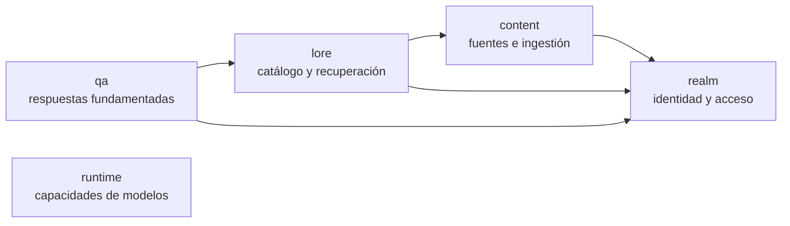
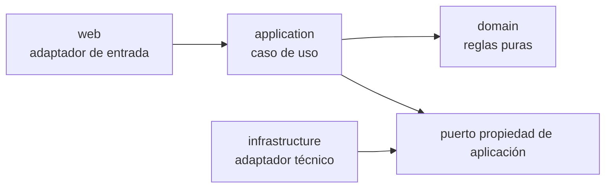
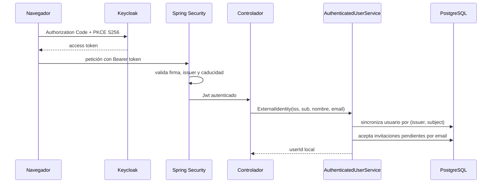
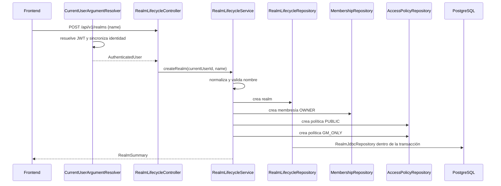
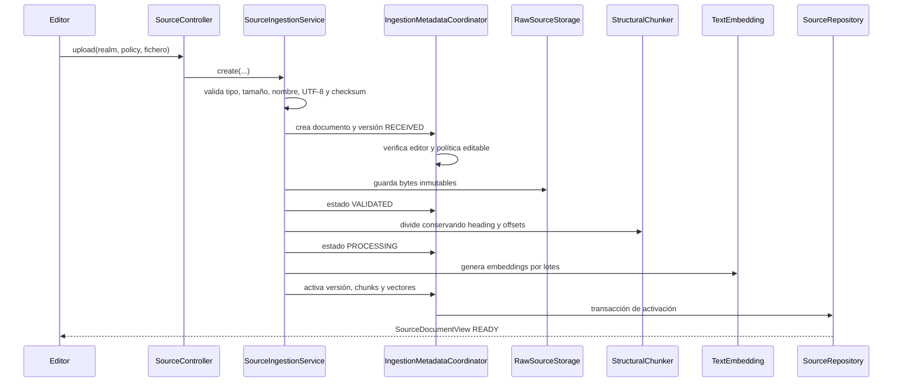
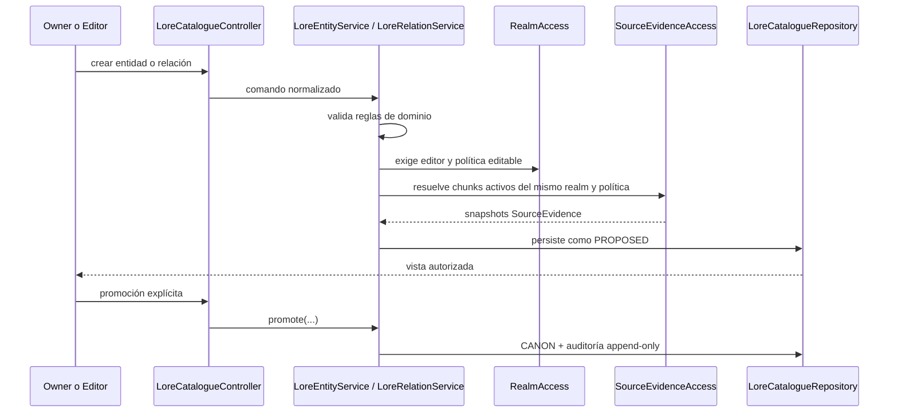
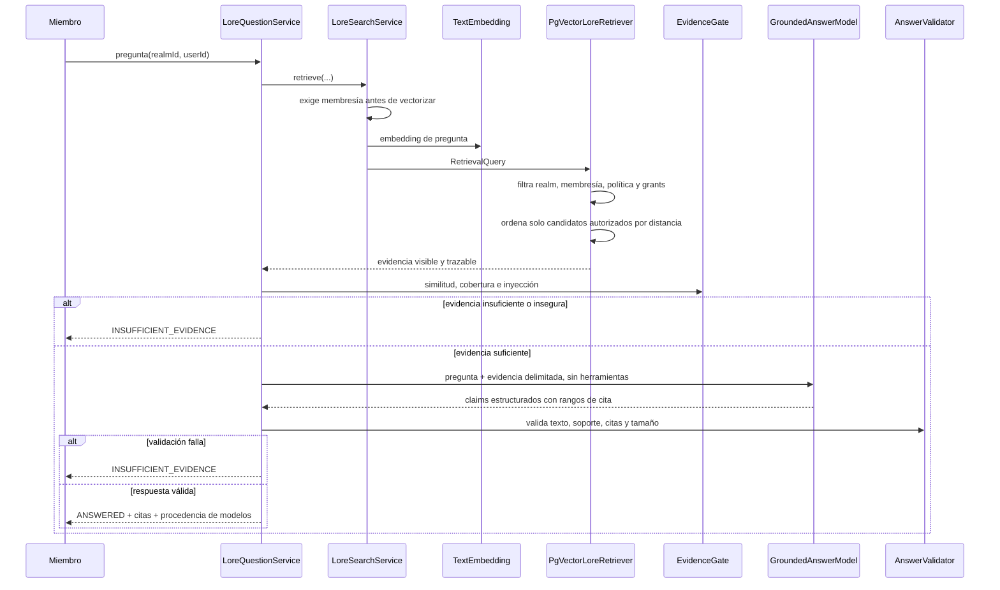

# Guía de defensa técnica de Codex of Realms

> Historical record. See [current documentation](../../README.md) for setup and behavior.

Esta guía repasa las decisiones técnicas del proyecto para preparar una entrevista: qué problema resuelve cada una, cómo se comprueba y cuándo convendría cambiarla.

> Estado de referencia: árbol de trabajo local revisado el 30 de agosto de 2026. La arquitectura puede evolucionar; las decisiones estables están en los ADR y los detalles de implementación deben contrastarse con el código actual.

## 1. La explicación de 90 segundos

Codex of Realms es una aplicación local y multiusuario para gestionar conocimiento de mundos narrativos. Permite organizar usuarios en *realms*, proteger información pública, reservada para dirección o con spoilers, ingerir fuentes versionadas, recuperar fragmentos mediante búsqueda vectorial, mantener un catálogo de conocimiento canónico y generar respuestas con citas.

La decisión principal es implementarlo como un **monolito modular** en Java 21 y Spring Boot, con PostgreSQL y pgvector. Es un único despliegue porque el MVP tiene un desarrollador, una base de datos, una máquina objetivo y ninguna necesidad medida de escalar o desplegar capacidades por separado. Dentro del proceso, Spring Modulith separa cinco módulos de negocio y verifica sus dependencias:

- `realm` posee identidades locales, realms, membresías, roles, políticas y permisos.
- `content` posee documentos, versiones inmutables, almacenamiento, fragmentos y embeddings.
- `lore` posee recuperación autorizada, entidades, relaciones, canon y procedencia.
- `qa` decide si hay evidencia suficiente, llama al modelo y valida afirmaciones y citas.
- `runtime` informa de las capacidades disponibles sin acoplar la aplicación a Ollama.

La idea que une todo el diseño es: **la identidad, la autorización, la evidencia y el canon no se delegan al modelo ni al cliente**. El servidor los deriva y verifica.

## 2. Cómo responder una pregunta técnica

Para explicar una decisión, sigue esta secuencia:

1. **Problema:** ¿qué riesgo o necesidad existe?
2. **Decisión:** ¿qué opción se eligió?
3. **Mecanismo:** ¿qué componentes la implementan?
4. **Garantía:** ¿qué invariante o prueba demuestra que funciona?
5. **Coste:** ¿qué complejidad o limitación introduce?
6. **Evolución:** ¿qué evidencia justificaría cambiarla?

Ejemplo:

> Necesitamos impedir que un jugador descubra spoilers. Keycloak solo autentica; la aplicación conserva membresías y permisos en PostgreSQL. `RealmAccess` expone la frontera de autorización y las consultas SQL excluyen fragmentos no autorizados antes de calcular la similitud. Las pruebas de autorización verifican usuarios y realms distintos. El coste es que las consultas son más específicas del dominio. Solo separaría esta responsabilidad o añadiría otro mecanismo si apareciese una necesidad medida que el modelo relacional no pudiera cubrir.

## 3. Decisiones estructurales que debes poder defender

### 3.1 Por qué un monolito modular

**Problema.** El producto contiene varias capacidades, pero todavía no existen equipos independientes, despliegues separados, límites de escalado distintos ni requisitos de disponibilidad que justifiquen una red entre ellas.

**Decisión.** Un proceso Spring Boot, una base de datos PostgreSQL y módulos separados por paquetes y contratos públicos.

**Ventajas.**

- Arranque, depuración y despliegue local sencillos.
- Transacciones atómicas para los primeros casos de uso.
- Menos fallos de red, contratos distribuidos y consistencia eventual.
- Posibilidad de observar el acoplamiento real antes de extraer servicios.

**Costes.**

- Todos los módulos comparten proceso y ciclo de publicación.
- Una disciplina de paquetes deficiente podría convertirlo en un monolito acoplado.
- Una futura extracción requeriría migrar datos y definir consistencia distribuida.

**Garantías actuales.** `ApplicationModulesTest` verifica las dependencias entre módulos. `InternalArchitectureTest` impide que aplicación y dominio dependan de adaptadores externos.

**Cuándo cambiarlo.** Cuando exista una necesidad medida de escalado, disponibilidad, propiedad por equipos o despliegue independiente. “Los microservicios son modernos” no es un criterio suficiente.

### 3.2 Capas internas y puertos

El patrón interno es:

- `web` traduce HTTP y JWT a comandos de aplicación.
- `application` coordina el caso de uso y la transacción.
- `domain` valida reglas que no necesitan Spring, JDBC o HTTP.
- Los puertos describen lo que la aplicación necesita.
- `infrastructure` implementa esos puertos con PostgreSQL, archivos, Spring AI u Ollama.

La inversión importante es que `SourceIngestionService` depende de `RawSourceStorage` y `TextEmbedding`, no de una clase concreta de disco u Ollama. Esto permite sustituir infraestructura y usar dobles deterministas en pruebas.

### 3.3 Por qué PostgreSQL también almacena vectores

La autorización depende de membresías, roles, políticas y grants relacionales que cambian con el tiempo. Mantener los vectores en pgvector permite filtrar candidatos mediante esas relaciones y ordenar por similitud en la misma consulta. Así se evita copiar permisos mutables como metadatos desincronizados a un almacén vectorial independiente.

El coste es depender de SQL nativo para la consulta crítica. Se acepta porque esa consulta expresa una regla de seguridad del dominio. Un índice aproximado se introduciría únicamente si el corpus real incumple objetivos medidos de latencia y después de evaluar su efecto sobre el *recall*.

## 4. Flujo 1: autenticación e identidad local

### Objetivo

Demostrar quién realiza una petición sin convertir al proveedor de identidad en dueño de las reglas del producto.

### Recorrido

### Componentes y responsabilidades

- `frontend/src/auth.ts` inicia Keycloak con flujo estándar y PKCE `S256`, refresca el token y lo mantiene en memoria.
- `SecurityConfiguration` hace la API *stateless* y exige JWT para todos los endpoints salvo salud y documentación.
- `OidcIdentityMapper` extrae `iss`, `sub`, nombre y email de un JWT ya validado.
- `AuthenticatedUserService` sincroniza la identidad externa con el usuario local.
- `RealmAccess` ofrece a otros módulos una fachada estable para identidad y autorización.

### Invariantes

- `(issuer, subject)` identifica de forma única a una identidad externa.
- El token demuestra identidad, no membresía, rol ni acceso a spoilers.
- Los roles y permisos efectivos se leen desde PostgreSQL.
- Una petición sin token válido no llega al caso de uso.
- El navegador no decide qué contenido puede ver.

### Preguntas de defensa

**¿Por qué Keycloak y no contraseñas propias?** Porque almacenar credenciales, emitir tokens y gestionar sesiones ampliaría la superficie de seguridad sin aportar valor diferencial al producto. Keycloak proporciona una frontera OIDC realista y reproducible localmente.

**¿Por qué no usar los roles de Keycloak?** Porque `OWNER`, `EDITOR` y `PLAYER` son relativos a cada realm. Un mismo usuario puede ser propietario en un realm y jugador en otro. La autorización pertenece al dominio de Codex of Realms.

**¿Por qué sincronizar un usuario local?** Para referenciar de forma estable creadores, membresías, invitaciones y auditoría sin propagar identificadores del proveedor por todo el dominio.

**¿Qué cambiaría en producción?** Podría cambiar el proveedor OIDC y su operación, pero se mantendrían la identidad local y las reglas de autorización. El contrato depende de OIDC, no de tipos internos de Keycloak.

## 5. Flujo 2: creación de un realm

### Objetivo

Crear una frontera aislada de conocimiento y asegurar que nunca nace sin propietario ni políticas mínimas.

### Recorrido

### Razón del diseño

`CurrentUserArgumentResolver` traduce el JWT antes de entrar en el controlador. `RealmLifecycleController` recibe el
usuario ya sincronizado y delega en `RealmLifecycleService`, que mantiene la transacción de creación y aplica sus
reglas. Los puertos de lifecycle, membership y access son contratos separados implementados por el mismo
`RealmJdbcRepository`.

La creación agrupa realm, propietario y políticas iniciales en una transacción. Si falla un paso, no queda un realm parcialmente inicializado.

### Invariantes

- Todo realm tiene al menos un `OWNER` activo.
- La última persona propietaria no puede degradarse ni eliminarse.
- Las operaciones se acotan siempre por `realmId`.
- `PUBLIC` significa público para miembros activos, no público en Internet.
- Los cambios sensibles bloquean la fila del realm y repiten la comprobación de rol dentro de la transacción.

### Sobre los slices de `realm.application`

La aplicación se divide por capacidades: `identity`, `lifecycle`, `membership`, `invitation` y `access`. Cada servicio público representa casos de uso relacionados y controla su frontera transaccional. `RealmAuthorizationService` concentra las comprobaciones de miembro, editor y propietario, incluidas las secuencias de comprobar-bloquear-recomprobar.

La división reduce el acoplamiento de pruebas y hace explícitos los ejes de cambio. Los slices disponen de los
puertos estrechos `RealmLifecycleRepository`, `MembershipRepository`, `InvitationRepository` y
`AccessPolicyRepository`; se conserva un único adaptador JDBC porque fragmentar el SQL no aportaría todavía una
frontera operativa nueva.

### Preguntas de defensa

**¿Por qué devolver 404 ante falta de permisos?** Para no revelar si un realm, política o miembro existe. Los casos inexistente e inaccesible son indistinguibles para el cliente.

**¿Por qué repetir comprobaciones después de bloquear?** Para evitar que dos cambios concurrentes retiren o degraden al último propietario tras haber validado ambos contra un estado antiguo.

## 6. Flujo 3: ingestión de una fuente

### Objetivo

Convertir Markdown o texto plano no confiable en versiones inmutables, fragmentos trazables y vectores recuperables sin perder procedencia ni control de acceso.

### Recorrido

### Responsabilidades

- `SourceFileValidator`: valida la entrada y calcula el checksum.
- `SourceIngestionService`: orquesta almacenamiento, fragmentación y embeddings.
- `IngestionMetadataCoordinator`: concentra autorización, versiones, estados y activación en transacciones cortas.
- `SourceManagementService`: agrupa listado, detalle, chunks, contenido y retirada.
- `SourceMetadataCoordinator`: limita las transacciones de consulta y retirada; la E/S de archivos queda fuera.
- `SourceEvidenceService`: autoriza, deduplica y limita la evidencia activa; `SourceEvidenceAccess` es su fachada pública.
- `RawSourceStorage`: puerto para bytes originales.
- `StructuralChunker`: produce fragmentos con encabezado y posiciones.
- `TextEmbedding`: puerto pequeño y neutral al proveedor.
- `SourceRepository`: conserva documentos, versiones, estados, chunks y vectores.
- `SourceDocumentView`: modelo de lectura que la API serializa y el frontend representa con un tipo equivalente.

### Versionado e idempotencia

El documento es la identidad lógica; cada sustitución crea una versión inmutable. El *pipeline fingerprint* incluye configuración de fragmentación y modelo de embedding. Si checksum, política y fingerprint no cambian, la sustitución o reprocesamiento es un *no-op*. Si cambia el contenido o el pipeline, se crea una versión nueva.

La versión anterior solo deja de estar activa cuando la nueva versión, sus chunks y embeddings se activan correctamente. Los errores se registran como `FAILED` con una categoría controlada.

### Por qué `TextEmbedding` no debe dividirse ahora

La interfaz solo ofrece embedding individual o por lotes y un descriptor de proveedor/modelo. Ingestión la usa para indexar y recuperación para vectorizar preguntas con el mismo espacio vectorial. La baja cohesión de la comunidad de Graphify describe un conjunto amplio de nodos alrededor de embeddings; no demuestra que la interfaz tenga responsabilidades incompatibles.

### Preguntas de defensa

**¿Por qué la ingestión es síncrona?** Porque el MVP limita tipo y tamaño de archivo y no existe un requisito medido de disponibilidad o duración que justifique cola, broker, reintentos distribuidos y consistencia eventual.

**¿Cuándo pasaría a segundo plano?** Cuando la duración supere límites acordados, una petición pueda perderse al reiniciar el proceso o se necesiten varios trabajadores. El versionado y los estados ya preparan esa evolución.

**¿Por qué almacenar los bytes originales?** Para poder reabrir una cita y reprocesar exactamente la versión que originó los chunks, conservando auditoría y reproducibilidad.

## 7. Flujo 4: catálogo y canon

### Objetivo

Representar personajes, lugares, facciones, objetos, eventos y relaciones de forma navegable sin permitir que un modelo convierta automáticamente una sugerencia en verdad canónica.

### Recorrido de creación y promoción

### Entidades, relaciones y evidencia

- Una entidad nace como `PROPOSED`.
- Una relación es direccional y sus dos extremos deben estar activos en el mismo realm.
- La visibilidad de una relación exige poder ver su propia política y las políticas de ambos extremos.
- Editar un elemento canónico lo devuelve a `PROPOSED`; la aprobación anterior no se reutiliza silenciosamente.
- Promover a `CANON` es una acción humana separada y auditada.
- Una entidad con relaciones activas no se elimina en cascada: primero deben retirarse explícitamente las relaciones.

`SourceEvidence` es un contrato público e inmutable de `content`. Contiene documento, versión, chunk, título, checksum, encabezado y offsets. Conecta intencionalmente fuentes y catálogo: una afirmación estructurada puede demostrar de dónde procede. El snapshot sobrevive a la retirada de la fuente para conservar auditoría, aunque abrir el contenido completo siga exigiendo una versión activa y autorizada.

### Preguntas de defensa

**¿Por qué catálogo manual si ya existe un LLM?** Porque un modelo genera propuestas, no autoridad. La promoción humana evita que una alucinación o una inyección se conviertan automáticamente en canon.

**¿Por qué copiar un snapshot de evidencia en vez de mantener solo una clave foránea viva?** Porque retirar una fuente no debe borrar la procedencia histórica ni bloquear el ciclo de vida de las fuentes. Los identificadores inmutables y el checksum dejan claro qué versión apoyó la afirmación.

**¿No duplica datos?** Sí, deliberadamente. Es una duplicación pequeña y controlada para obtener un registro de auditoría estable. No es una segunda fuente mutable de verdad.

## 8. Flujo 5: pregunta RAG con citas

### Objetivo

Responder desde la perspectiva exacta de un miembro, sin exponer información oculta y sin confiar en que el modelo respete por sí solo autorización, evidencia o formato.

### Recorrido

### La decisión de seguridad más importante

La consulta de pgvector crea primero `authorized_chunks` con realm, membresía, versión activa, política y grants; después calcula la distancia. Por tanto, un fragmento oculto no entra en el ranking ni en el contexto del modelo. Filtrar después del *top-k* sería incorrecto: además de degradar resultados, podría introducir canales laterales y comportamientos distintos según la existencia de información secreta.

### Defensa en profundidad

1. Se exige membresía antes de calcular el embedding.
2. SQL excluye evidencia no autorizada antes del ranking.
3. `EvidenceGate` rechaza ausencia de evidencia, baja similitud, baja cobertura e indicadores de inyección directa o indirecta.
4. El modelo recibe contexto acotado y no tiene herramientas.
5. La salida es estructurada en afirmaciones y rangos de evidencia.
6. `AnswerValidator` comprueba que cada cita exista, sea única, apoye lexicalmente la afirmación y que el resultado respete límites.
7. Ante duda o fallo del modelo, la respuesta se cierra como `INSUFFICIENT_EVIDENCE`.

### Preguntas de defensa

**¿Por qué no dejar que el modelo decida si sabe responder?** Porque esa decisión sería no determinista y manipulable mediante el prompt o las fuentes. El umbral de evidencia es una política de producto que debe ser reproducible y calibrable.

**¿La cobertura léxica demuestra verdad?** No. Es una barrera determinista contra afirmaciones evidentemente no respaldadas, no una prueba semántica completa. La calidad se complementa con un conjunto de evaluación versionado y métricas de recuperación y rechazo.

**¿Por qué convertir fallos distintos en insuficiencia de evidencia?** Para fallar de forma segura y no revelar si existe material oculto o qué componente interno falló. La observabilidad interna conserva categorías de bajo nivel sin exponer contenido sensible.

**¿Por qué modelos locales?** Para privacidad, reproducibilidad y ejecución sin servicios de pago. El coste es una calidad y capacidad limitadas por el hardware; por eso la selección se basa en evaluación y los controles críticos permanecen fuera del modelo.

## 9. Cómo interpretar los nodos que parecían sospechosos

### Servicios de aplicación de `realm`

Los slices de aplicación son internos al módulo y no permiten acceso directo de otros módulos a la base de datos.
`RealmAccess` conserva la frontera pública mínima y delega en identidad y autorización. Los controladores de
lifecycle, membership, invitation y access-policy dependen cada uno de un único servicio especializado.

### `SourceDocumentView`

Es un modelo de lectura propiedad de aplicación. `SourceJdbcRepository` lo construye, el caso de uso lo devuelve, Spring lo serializa y TypeScript mantiene un contrato equivalente. No existe una conexión directa frontend-base de datos. Se separarían DTO HTTP y proyección interna si sus consumidores o ritmos de cambio divergieran.

### `SourceEvidence`

Es el contrato de procedencia entre `content` y `lore`. Su centralidad es deseada: evita que `lore` acceda al repositorio interno de `content` y expresa exactamente la información segura que puede cruzar el límite.

### Nodos de ingestión débilmente conectados

Enums como `RECEIVED`, records pequeños y excepciones pueden tener pocas aristas estáticas aunque sean importantes en ejecución. La conectividad del grafo es una señal para investigar documentación o llamadas no detectadas, no una prueba de código muerto o arquitectura rota.

### `TextEmbedding`

Es un puerto pequeño compartido por indexación y consulta. No se divide por la baja cohesión del *cluster*. Se reconsideraría si generación de documentos y consulta necesitaran contratos, proveedores o ciclos de vida realmente distintos.

### `RealmAuthorizationIntegrationTest`

Sí es deuda organizativa plausible: supera las mil líneas y agrupa escenarios de infraestructura, realms, membresías, fuentes, catálogo y recuperación. La separación razonable es por comportamiento (`RealmAccessIT`, `MembershipInvitationIT`, `SourceLifecycleIT`, `LoreCatalogueIT`, `RetrievalAuthorizationIT`) con fixtures comunes. No se cambia la cobertura; se mejora localización y diagnóstico.

### `RealmApi`

El frontend conserva una única implementación `HttpRealmApi` y el punto de composición `api.realm`, pero sus hooks
dependen de contratos específicos de identidad, lifecycle, membership, invitation y access-policy. La composición
completa sólo se utiliza donde realmente se necesita.

## 10. Estrategia de pruebas: qué demuestra cada nivel

| Nivel | Qué demuestra | Qué no demuestra |
|---|---|---|
| Dominio/unitario | Normalización, invariantes y gates deterministas | Integración SQL o configuración Spring |
| Arquitectura | Dependencias permitidas entre módulos y capas | Comportamiento funcional |
| Persistencia | Consultas, restricciones y pgvector reales | Flujo completo del navegador |
| Autorización | Matrices de roles, grants, aislamiento y no divulgación | Calidad de un modelo real |
| API | Rutas, validación y formas de error/citas | Usabilidad visual completa |
| Frontend | Estados y flujos del usuario | Seguridad del backend |
| Evaluación RAG | Recall, rechazo, grounding y modelo candidato | Corrección universal de todas las preguntas |

Regla de defensa: ninguna prueba individual “demuestra que todo funciona”. La confianza procede de capas complementarias.

La puerta reproducible principal es `backend/mvnw.cmd verify`; el frontend añade sus pruebas, lint y cobertura. Los modelos reales se evalúan separadamente para que CI no dependa de respuestas no deterministas ni de disponer de GPU.

## 11. Deuda técnica y criterios de prioridad

### Prioridad razonable

1. Dividir `RealmAuthorizationIntegrationTest` conservando exactamente sus garantías.
2. Mantener actualizados diagramas, ADR y esta guía cuando cambien contratos de módulos.
3. Generar contratos TypeScript desde OpenAPI cuando el coste de mantener modelos equivalentes lo justifique.
4. Dividir físicamente `RealmJdbcRepository` solo si aparecen fronteras de persistencia independientes verificables.
5. Medir catálogo, ingestión y recuperación antes de añadir paginación, trabajo asíncrono o índices aproximados.

### Señales que justifican refactorizar

- Una clase cambia habitualmente por funcionalidades no relacionadas.
- Sus pruebas requieren preparar demasiados subsistemas para un caso sencillo.
- Un consumidor depende de métodos que nunca utiliza.
- Una frontera deja escapar tipos de JDBC, Spring, Ollama o HTTP.
- Aparecen ciclos o dependencias prohibidas por Spring Modulith.
- Las métricas reales incumplen un objetivo acordado.

### Señales que no bastan por sí solas

- Número de líneas sin analizar responsabilidades.
- Centralidad o baja cohesión de un grafo automático.
- Preferencia estética por más clases o servicios.
- Aplicar microservicios, eventos o patrones porque son populares.

## 12. Guion para una defensa oral

### Apertura

> El proyecto prioriza aislamiento de realms, control de spoilers, procedencia y respuestas RAG que sepan abstenerse. Elegí un monolito modular porque todavía no hay requisitos medidos que justifiquen distribución. Los módulos se verifican automáticamente y las dependencias apuntan hacia las fronteras de autorización y contenido.

### Recorrido recomendado

1. Presentar el producto y sus invariantes, no la lista de tecnologías.
2. Explicar el monolito modular y los cinco propietarios de datos.
3. Seguir una fuente desde el upload hasta una cita.
4. Mostrar que autorización ocurre antes del ranking.
5. Mostrar que el modelo no decide permisos, suficiencia ni canon.
6. Reconocer costes: proceso único, SQL específico, ingestión síncrona y validación conservadora.
7. Cerrar con criterios medibles de evolución.

### Si no sabes una respuesta

Una respuesta profesional es:

> No quiero inventar el motivo. Lo que sí puedo demostrar en el diseño actual es X y la garantía Y. Revisaría el ADR y la prueba Z antes de decidir si debe cambiarse.

Al explicar el proyecto, distingue lo que está comprobado, lo que está previsto y lo que cambiarías.

## 13. Autoevaluación

Deberías poder explicar sin mirar código:

- [ ] Qué problema resuelve el producto y qué excluye el MVP.
- [ ] Por qué se eligió un monolito modular.
- [ ] Qué posee cada módulo y en qué dirección dependen.
- [ ] La diferencia entre autenticación y autorización.
- [ ] Por qué los roles de realm no están en Keycloak.
- [ ] Cómo nace un realm con un propietario y políticas válidas.
- [ ] La diferencia entre documento y versión.
- [ ] Qué hace idempotente una ingestión.
- [ ] Por qué se filtra antes de ordenar por similitud.
- [ ] Qué hace el gate antes del modelo.
- [ ] Qué valida la aplicación después del modelo.
- [ ] Por qué una respuesta puede abstenerse aunque el modelo esté disponible.
- [ ] Por qué la evidencia del catálogo es un snapshot.
- [ ] Por qué el modelo no puede promover canon.
- [ ] Qué deuda técnica abordarías primero y con qué criterio.

## 14. Fuentes de verdad del proyecto

- [Arquitectura general](ARCHITECTURE.md)
- [Módulos de aplicación](../../architecture/MODULES.md)
- [ADR-001: monolito modular](../../architecture/adr/ADR-001-modular-monolith.md)
- [ADR-002: proveedor OIDC local](../../architecture/adr/ADR-002-local-identity-provider.md)
- [ADR-005: ingestión y versiones](../../architecture/adr/ADR-005-source-ingestion.md)
- [ADR-006: recuperación con autorización](../../architecture/adr/ADR-006-access-aware-retrieval.md)
- [ADR-007: gate y validación de respuestas](../../architecture/adr/ADR-007-deterministic-grounded-answers.md)
- [ADR-009: catálogo manual y canon](../../architecture/adr/ADR-009-manual-lore-catalogue.md)
- [Modelo de autorización](../../security/AUTHORIZATION_MODEL.md)
- [Modelo de dominio](../product/DOMAIN_MODEL.md)
- [Lenguaje ubicuo](../product/GLOSSARY.md)
- [Contrato de alcance MVP](../../product/MVP_SCOPE.md)
- [Operación de ingestión](../operations/SOURCE_INGESTION.md)
- [Operación de respuestas fundamentadas](../operations/GROUNDED_ANSWERS.md)
- [Operación del catálogo](../operations/LORE_CATALOGUE.md)
