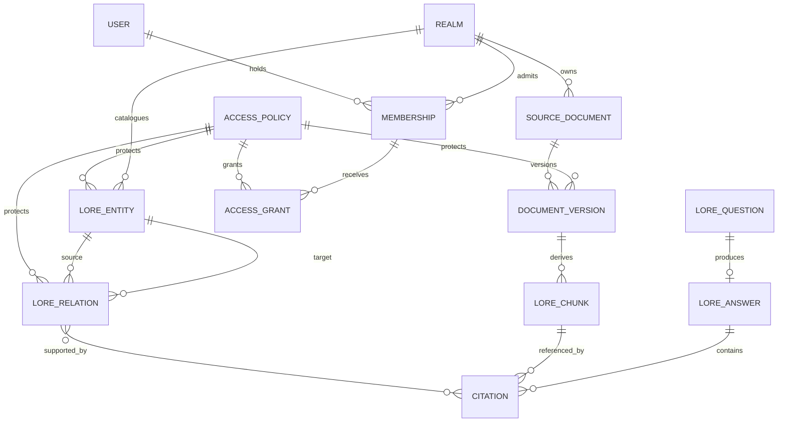

# Initial Domain Model

This model captures the minimum domain needed by the MVP. It is conceptual: persistence annotations, table shapes, API payloads, and framework types do not belong here.

## Context map

The diagram shows ownership and conceptual relationships, not database cardinality decisions. In particular, citations may be represented as immutable answer values rather than independent aggregate roots.

## Aggregate boundaries

### Realm

**Owns:** realm identity, lifecycle, and display metadata.

Memberships and effective access belong to the `realm` module because they define who may act within that realm's boundary.

**Rules:**

- A realm is the mandatory scope for every lore operation.
- Deactivating a realm prevents retrieval before any content lookup.
- A realm identifier supplied in a URL is never sufficient proof of access.

### Membership

**Owns:** user-to-realm role, active state, and explicit spoiler grants.

**Rules:**

- A user has at most one active membership per realm.
- `OWNER` and `EDITOR` can access `GM_ONLY` material in the MVP.
- `PLAYER` can access `PUBLIC` material plus explicitly granted `SPOILER` material.
- Revocation affects the next request; it does not depend on model memory or cached conversation context.

### Source document

**Owns:** logical source identity and its ordered immutable versions.

**Rules:**

- Exactly one version may be active after successful processing.
- Failed processing never replaces the last valid active version.
- Raw content, chunks, and embeddings record the version that produced them.
- Deletion makes all derived chunks ineligible for retrieval.

### Document version

**Owns:** checksum, source location, language, media type, processing lifecycle, access policy, and derived chunks.

Proposed lifecycle:

`RECEIVED -> VALIDATED -> PROCESSING -> READY`

Failure from a processing state produces `FAILED`; deletion produces `RETIRED`. The MVP processes synchronously, but the lifecycle deliberately does not depend on that mechanism.

### Lore entity

**Owns:** stable identity, type, display name, aliases, description, canon status, access policy, and provenance references.

Initial types are `CHARACTER`, `PLACE`, `FACTION`, `OBJECT`, and `EVENT`.

### Lore relation

**Owns:** directional relation type, source entity, target entity, canon status, access policy, and supporting citations.

**Rules:**

- Both entities belong to the same realm.
- A canonical relation must have human-authored provenance or an explicit human promotion record.
- A relation cannot expose either endpoint to a viewer who lacks effective access.

### Lore answer

An answer is an immutable result value rather than canonical lore.

It contains:

- Outcome: `ANSWERED` or `INSUFFICIENT_EVIDENCE`
- Answer text when applicable
- Validated citations
- Model and retrieval provenance suitable for evaluation
- Safe diagnostic identifiers, not hidden source information

Persisting user question history is not required by the MVP. Evaluation runs may store results in reports outside the production domain.

## Access policy model

An access policy has a classification and optional explicit grants:

| Classification | Owner | Editor | Player without grant | Player with matching grant |
|---|---:|---:|---:|---:|
| `PUBLIC` | Allow | Allow | Allow | Allow |
| `GM_ONLY` | Allow | Allow | Deny | Deny |
| `SPOILER` | Allow | Allow | Deny | Allow |

This matrix is enforced in application and persistence queries. The model never receives inaccessible chunks and is never asked to decide whether a viewer may see them.

## Canon model

- Source documents accepted by an authorized editor enter as `CANON` unless explicitly uploaded as draft material.
- Structured entities and relations are `CANON` or `PROPOSED`.
- Generated answers are not lore records.
- Generated suggestions are transient by default and `PROPOSED` if deliberately saved in a later milestone.
- Promotion to `CANON` is an explicit audited human command.

## Citation model

A citation identifies:

- Realm
- Source document
- Immutable document version
- Chunk
- Structural heading
- Source location or offsets
- Display-safe source title

Before an answer is returned, every citation is checked against the authenticated viewer's current effective access and the active source state.

## Retrieval model

Retrieval is a domain-aware read operation, not a generic vector-store query exposed to clients. Its input includes authenticated identity, realm, normalized question, result limit, and server-owned policy parameters.

The database query applies realm, active-version, and effective-access predicates before ranking vectors. The result carries enough provenance for evidence gating and citation validation.

## Deferred domain questions

- Whether a future `World` contains multiple `Campaign` aggregates
- Fine-grained access policies within sections of one source document
- Time-dependent reveals and character-knowledge perspectives
- Branching or alternate canon
- Contradictory claims and temporal validity

These concepts are excluded from the current model rather than represented by unused abstractions.
